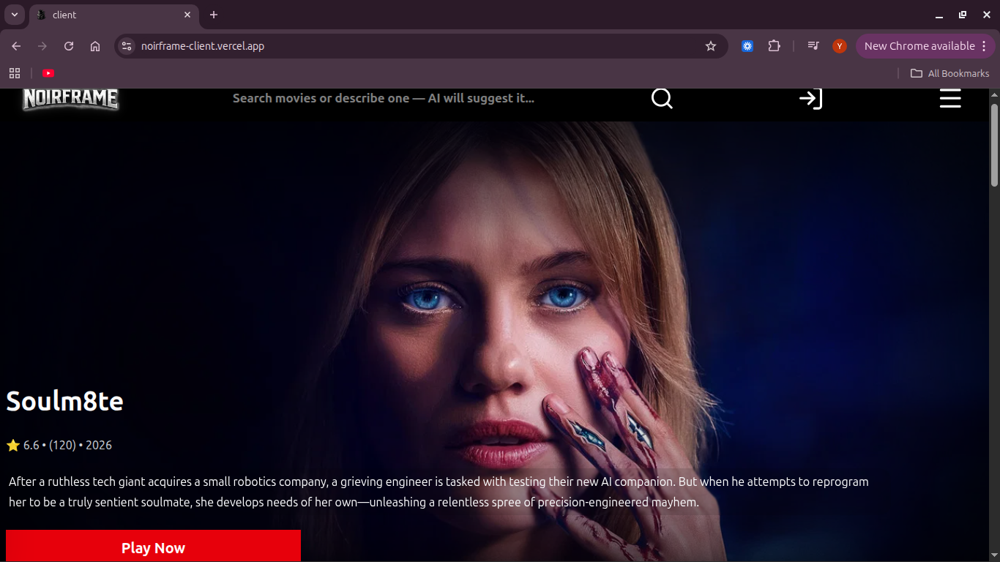
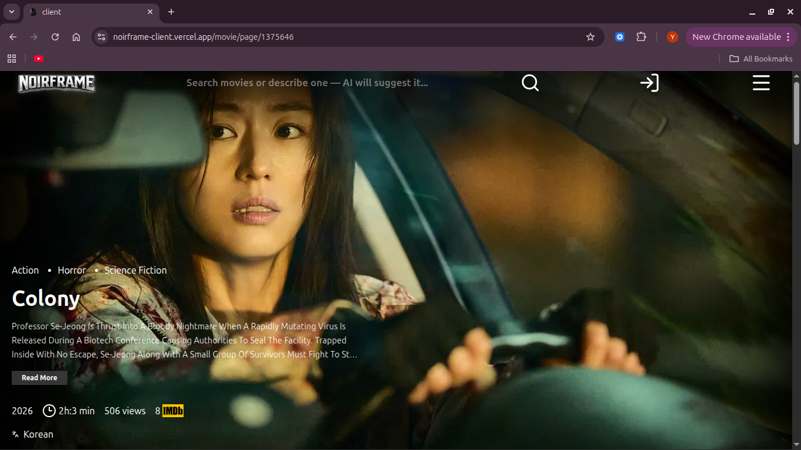
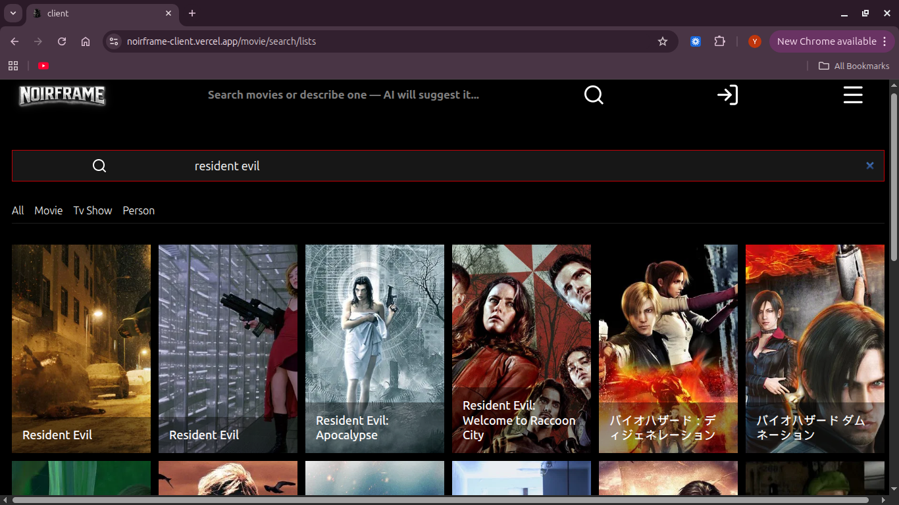
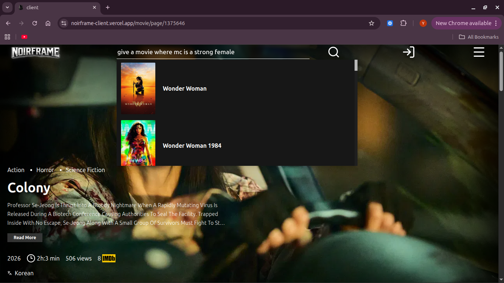
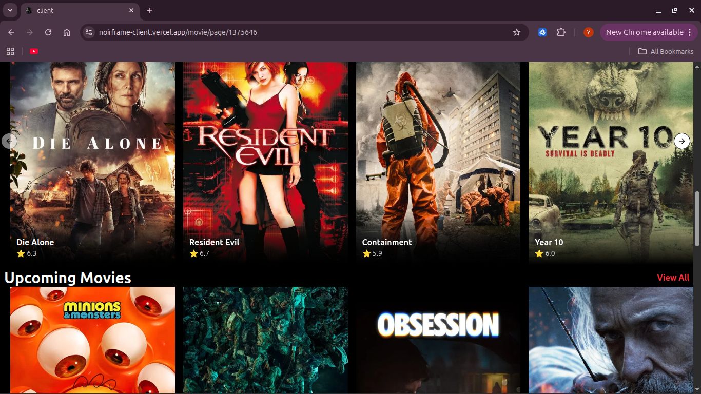
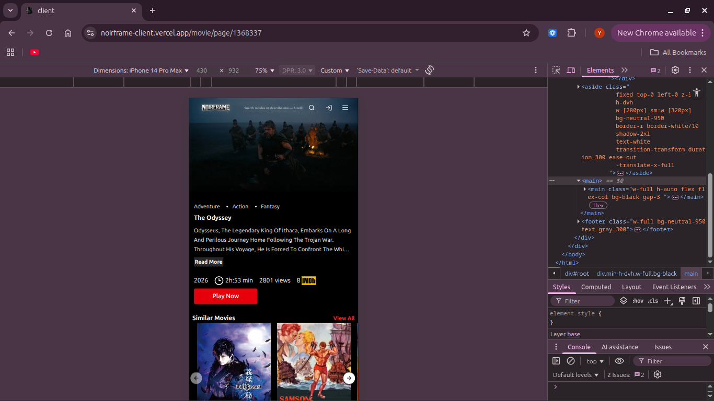
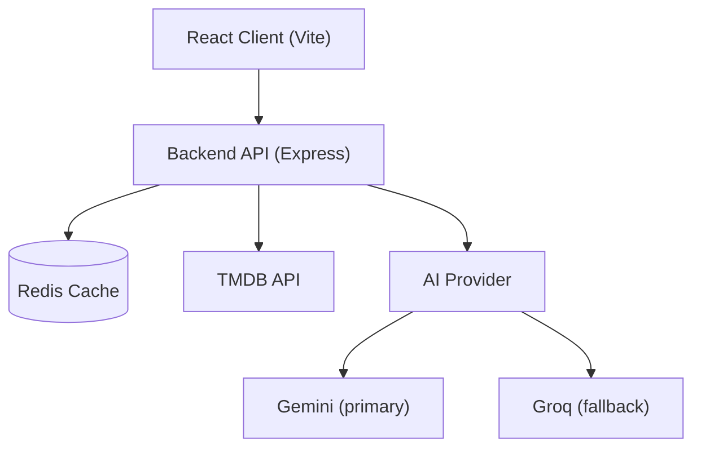

<p align="center">
  
</p>

<h1 align="center">NoirFrame</h1>

<p align="center">
  A frontend-focused, OTT-style movie discovery app built with React — browse trending and popular titles, dig into details, trailers, and reviews, and search either by title or by describing a movie in plain language and letting an AI layer figure out what you mean.
</p>

---

## 🚀 Quick Access

| | |
|---|---|
| 🖥️ **Live Demo** | [noirframe-client.vercel.app](https://noirframe-client.vercel.app) |
| 💻 **Repository** | [github.com/TrainedDev/Noirframe](https://github.com/TrainedDev/Noirframe) |

> ⚠️ Movie data depends on an external API and a free-tier-hosted backend — see [Limitations](#️-external-api--free-tier-limitations) if something feels slow on first load.

### How to use NoirFrame

1. Open the live site — the home page auto-plays through a hero carousel of now-playing movies, plus trending, popular, top-rated, and upcoming rows.
2. Click any movie poster to open its full details page.
3. Watch the trailer directly in-page, read the overview/genres/cast info, and browse similar and recommended titles.
4. Scroll down for user reviews, or view the full list on a dedicated reviews page.
5. Use the search bar to find a movie by title — or describe one in natural language (e.g. *"movie where a guy relives the same day over and over"*) and let the AI layer suggest matching titles.
6. Use the filter sidebar to browse by genre, tag, release year, or runtime.

---

## ✨ Features

- **Home discovery feed** — hero carousel of now-playing movies, plus trending (this week), popular, top-rated, and upcoming rows
- **Movie details** — trailer playback, genres, tags, runtime, rating, spoken languages, and overview
- **Similar & recommended movies** — surfaced on every movie's detail page
- **Reviews** — preview on the movie page, with a dedicated full reviews list page
- **Unified search** — one search box that handles both exact-title search and natural-language descriptions, with live-typing suggestions in the navbar
- **AI-assisted movie discovery** — long or descriptive queries are interpreted by an AI layer before being resolved against real movie data (see below)
- **Genre/tag/year/runtime filtering** — a dedicated filter sidebar for building custom movie lists
- **Custom error states** — themed illustrations for 404 / 502 / 504 / 500 responses instead of generic error text
- **Responsive UI** — mobile-first layouts across the home feed, movie details, search, and filters
- **Redux Toolkit state management** — five feature slices with consistent async-thunk loading/error handling

There is currently no user authentication, watchlist, or account system in the codebase — the app is a fully public, session-less browsing experience.

---

## 🤖 AI-Powered Movie Discovery

NoirFrame's search bar doesn't just match titles — it can also interpret a loosely-described movie.

```
User types a query
        ↓
Backend checks: is this a description, or a title?
 (long query, or contains words like "recommend", "similar", "like", "movie"...)
        ↓
  Description path                Title path
        ↓                              ↓
   AI model (Gemini)              TMDB title search
        ↓
  Gemini returns nothing?
        ↓
   Fallback: Groq
        ↓
AI returns 2–3 candidate movie titles
        ↓
Each candidate is looked up via TMDB search
        ↓
Results are merged and returned to the client
```

- **Why this matters:** a normal search needs the exact title ("Interstellar"). NoirFrame's search also accepts something like *"a movie where a guy travels through time to save his daughter"* — the backend detects that this looks like a description (based on query length and trigger phrases) rather than a title, and routes it through the AI layer instead.
- **Gemini is the primary provider**, called first with a prompt asking for 2–3 candidate movie titles as JSON. **Groq is used as a fallback** — only invoked if Gemini's response is empty or fails — rather than both providers running simultaneously.
- Once the AI returns candidate titles, the backend resolves each one against TMDB's search API and merges the results — so the AI is only ever used to *guess titles*, never to fabricate movie data. Everything the user actually sees still comes from TMDB.
- This all happens behind a single endpoint and a single search box — there's no separate "AI search mode" the user has to switch into.

---

## 🎬 Movie Data & TMDB

All movie metadata — titles, posters/backdrops, overviews, genres, ratings, release info, cast/keyword tags, trailers, similar/recommended titles, and reviews — is sourced from **TMDB**, fetched server-side by the backend (the client never calls TMDB directly).

### Caching with Redis

The backend wraps every TMDB-backed endpoint in a cache-aside helper:

```
Client → Backend → Redis (cache check)

Cache hit  → Redis → response
Cache miss → TMDB → store in Redis (with TTL) → response
```

Each cache key is scoped to the request (e.g. a specific movie ID, a specific filter combination, or a specific search term), and cached entries expire after a configured TTL.

> ⚠️ **TMDB availability notice:** Because movie data depends on the external TMDB API, TMDB outages, rate limits, network issues, or API changes can affect **uncached** requests — the backend will surface a timeout/unreachable error for those. Redis caching reduces repeated external calls and can continue serving data that was already cached, but it cannot guarantee TMDB availability for requests that haven't been cached yet.

---

## 📸 Screenshots

> No page screenshots currently exist in this repository — the paths below are placeholders. Add the corresponding images to `docs/screenshots/` to populate this section.

<p align="center">
  
</p>

<p align="center">
  
</p>

<p align="center">
  
</p>

<p align="center">
  
</p>

<p align="center">
  
</p>

<p align="center">
  
</p>

---

## 🖥️ Frontend Architecture

The frontend is a **React 19 + Vite** SPA using:

- **React Router v7** for client-side routing
- **Redux Toolkit** for global state — five feature slices (`movie`, `movieDetails`, `review`, `searched`, `filterMovie`), each following the same async-thunk pattern (`pending` / `fulfilled` / `rejected`) with per-request loading flags and error states mapped to themed error illustrations
- **Tailwind CSS v4** for styling
- **Radix UI primitives** (avatar, dialog, radio-group, select, separator, tooltip, slot) as the base for a small set of `shadcn/ui`-style components in `components/ui`
- **Embla Carousel** for the home page's auto-sliding hero, and **react-player** for trailer video playback
- **react-error-boundary**, wrapping the whole layout to catch rendering errors gracefully
- A thin **API layer** per feature (`features/<feature>/api.js`) — plain functions wrapping a shared Axios instance — with a `createAppAsyncThunk` helper that normalizes error shape across every thunk

### Structure

```
Client/
├── src/
│   ├── app/            # Router, Redux store, providers
│   ├── components/
│   │   ├── common/     # Navbar, Sidebar, Footer, MovieCards, error page
│   │   └── ui/         # Reusable Radix/shadcn-style UI primitives
│   ├── features/       # One folder per domain: movie, movieDetails, review,
│   │                    # searchedMovie, specificFilteredMoviesList, tags
│   │   └── <feature>/
│   │       ├── api.js          # Axios calls to the backend
│   │       ├── <feature>Slice.js
│   │       ├── page/
│   │       └── component/
│   ├── layouts/         # MainLayout (Navbar + Sidebar + Footer + Outlet)
│   ├── hooks/           # useAutoSlider, use-mobile
│   ├── lib/             # Axios instance
│   └── utils/           # createAppAsyncThunk
```

Redux Toolkit is used here because the app juggles many independent, simultaneously-loading async data sets on a single page (e.g. a movie's details, its similar list, its recommended list, its reviews, and upcoming movies all load in parallel on the movie details page) — each with its own loading/error state that the UI needs to react to individually.

---

## 🏗️ Application Architecture



The backend exists so the frontend never talks to TMDB, Gemini, or Groq directly. It:

- **Protects third-party credentials** — TMDB tokens and AI API keys live only in backend environment variables, never in client code.
- **Centralizes third-party integration** — every movie-data and AI request goes through one Express API, keeping the client focused on rendering.
- **Handles caching** — the Redis cache-aside layer sits between the backend and TMDB, described above.
- **Handles AI routing** — deciding whether a query is a title or a description, calling Gemini/Groq, and resolving the results back into real TMDB movie data is entirely a backend responsibility.

---

## 🔄 How a Movie Request Works

```
User opens a movie page
        ↓
React component dispatches a Redux async thunk (e.g. getMoviesPage)
        ↓
features/movieDetails/api.js calls the backend (/movies/movie_page/:id)
        ↓
Backend controller → redisHelper cache check
        ↓
Cache hit  → return cached movie data
Cache miss → fetch from TMDB → cache it → return it
        ↓
Redux stores the result in state.movieDetails
        ↓
UI renders trailer, genres, cast info, similar/recommended rows
```

---

## 🔎 How AI Movie Search Works

```
User types into the search bar (title or description)
        ↓
Frontend sends the raw query to /movies/search/media
        ↓
Backend checks query length + trigger words
 (long query, or contains "recommend"/"similar"/"like"/"movie"/etc.)
        ↓
   Looks like a description?
        ↓ yes                         ↓ no
Try Gemini → candidate titles    Search TMDB directly with the raw query
        ↓
  Gemini returned nothing?
        ↓ yes
   Try Groq → candidate titles
        ↓
Each candidate title is searched on TMDB
        ↓
Merged results returned to the frontend
        ↓
Search results render with live poster previews
```

---

## 🛠️ Tech Stack

### Frontend
| | |
|---|---|
| Framework | React 19, Vite 7 |
| Routing | React Router v7 |
| State | Redux Toolkit, React-Redux |
| Styling | Tailwind CSS v4 |
| UI Primitives | Radix UI, `class-variance-authority`, `tailwind-merge` |
| Media | Embla Carousel, react-player |
| Resilience | react-error-boundary |
| HTTP | Axios |

### Backend
| | |
|---|---|
| Runtime | Node.js |
| Framework | Express 5 |
| HTTP client | Axios (server-side TMDB client) |

### Data / Caching
| | |
|---|---|
| Cache | Redis (`redis` client, cache-aside pattern with TTL) |

### External APIs / AI
| | |
|---|---|
| Movie data | TMDB API |
| AI (primary) | Google Gemini (`@google/genai`) |
| AI (fallback) | Groq (`groq-sdk`) |

---

## 📁 Project Structure

```
Noirframe/
├── Client/     # React (Vite) frontend
├── Backend/    # Express API — TMDB, Redis cache, AI routing
├── docs/       # Screenshot assets (see note above)
└── README.md
```

| Directory | Purpose |
|---|---|
| `Client` | React frontend — routing, UI, Redux state, API layer |
| `Backend` | Express API that integrates TMDB, Redis, and Gemini/Groq |
| `docs` | Documentation assets (screenshots) |

---

## ⚙️ Environment Variables

No `.env.example` is committed for the backend — set these based on the code (placeholders only, never real values):

### Client (`Client/.env`)

```env
VITE_BACKEND_URL=
```

### Backend

```env
PORT=
CLIENT_ORIGIN=
TMDB_BASE_URL=
TMDB_ACCESS_TOKEN=
REDIS_URL=
DEFAULT_EXP=
GEMINI_API_KEY=
GROQ_API_KEY=
```

- `PORT`, `TMDB_BASE_URL`, `TMDB_ACCESS_TOKEN`, and `REDIS_URL` are required for the backend to start and serve any movie data.
- `DEFAULT_EXP` sets the Redis cache TTL used by every cached endpoint.
- `GEMINI_API_KEY` is required for AI-assisted search to work at all; `GROQ_API_KEY` is only used as a fallback when Gemini's response is empty or errors.
- `CLIENT_ORIGIN` configures CORS to allow the deployed frontend's origin (in addition to `localhost:5173`, which is always allowed).

---

## 🚀 Local Development

### Clone

```bash
git clone https://github.com/TrainedDev/Noirframe.git
cd Noirframe
```

There is no root-level `package.json` — install and run the client and backend separately.

### Backend

```bash
cd Backend
npm install
npm run dev   # nodemon server.js — defaults to port 3000
```

Requires a reachable **Redis** instance (`REDIS_URL`) and a valid TMDB access token to serve movie data; a Gemini API key is needed for AI-assisted search to function (Groq is used only as a fallback).

### Client

```bash
cd Client
npm install
npm run dev   # vite — defaults to http://localhost:5173
```

Set `VITE_BACKEND_URL` in `Client/.env` to point at your running backend (e.g. `http://localhost:3000`).

---

## 🌐 Deployment

The live frontend is deployed at **[noirframe-client.vercel.app](https://noirframe-client.vercel.app)**, and the `Client/vercel.json` rewrite config confirms it targets Vercel's static/SPA hosting. The client's environment configuration also references a Vercel-hosted backend URL, indicating the Express API has likewise been deployed on Vercel rather than run as a persistent server.

---

## ⚠️ External API & Free-Tier Limitations

> ⚠️ **External API notice:** NoirFrame relies on TMDB for movie data. If TMDB is temporarily unavailable, rate-limited, or experiencing network issues, uncached movie requests may fail or take longer than usual. Redis caching reduces this risk for data that's already been requested once, but cannot eliminate it for new requests.

> ⚠️ **Free-tier deployment notice:** If the backend is deployed on free-tier/serverless infrastructure, requests after a period of inactivity may take longer than usual while the function/service cold-starts. Subsequent requests are typically faster.

These are external-service and hosting-tier characteristics, not application bugs.

---

## 🔐 Security

- Third-party credentials (TMDB access token, Gemini/Groq API keys, Redis URL) are read from backend environment variables and are never exposed to the client.
- `.env` files are excluded via `.gitignore` in both `Client` and `Backend` (the client's local `.env` only ever holds a public backend URL, never a secret).
- The client only receives a single public environment variable (`VITE_BACKEND_URL`) — no API keys are bundled into frontend code.
- CORS on the backend is restricted to an explicit list of allowed origins (`CLIENT_ORIGIN` plus localhost) rather than left open.

---

## 🎯 Project Goals

This project demonstrates:

- Building a real-world, production-styled React application rather than a tutorial clone
- Scalable, multi-slice Redux Toolkit state management with consistent async loading/error patterns
- A clean separation between a presentation-focused frontend and a backend that owns all third-party integration
- External API caching with Redis to reduce redundant calls and improve response times
- Practical AI integration — using an LLM to bridge natural language to structured search, with a fallback provider for resilience
- Thoughtful loading and error UX, including themed error states per failure type
- Responsive, component-driven UI built on reusable primitives

---

## 🔮 Future Improvements

- Automated tests (none currently exist in the repository)
- User accounts, watchlists, and favorites
- More advanced AI movie matching (e.g. disambiguating multiple plausible matches)
- Improved TMDB-outage fallback behavior for uncached requests
- Performance optimization and observability/monitoring
- Additional movie/streaming-availability data providers

---

## 📄 License

This repository currently has no license file / specified license.